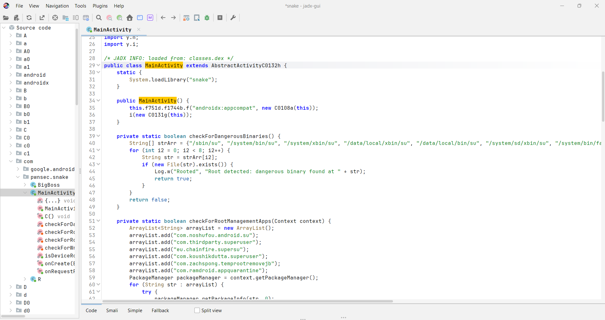
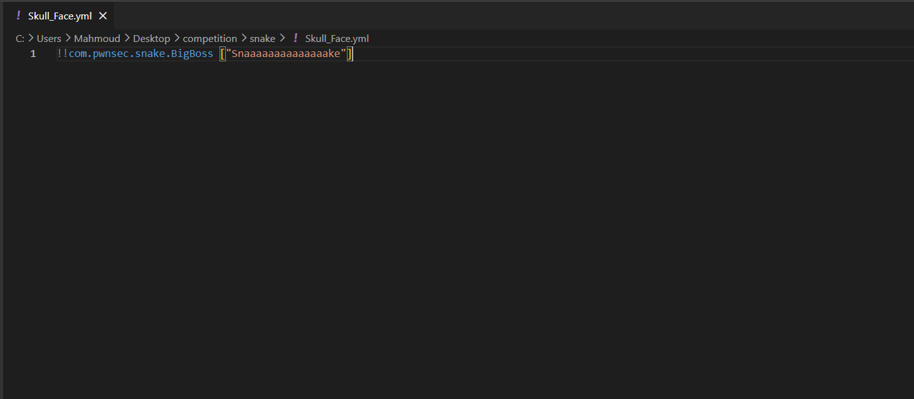
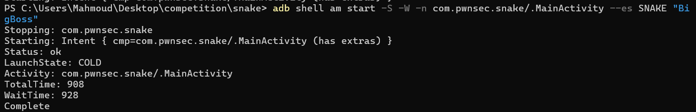
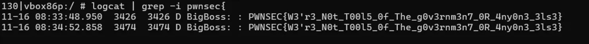
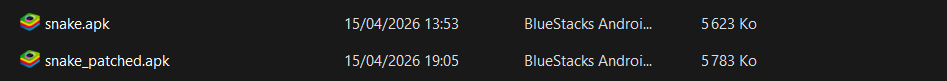

# 🐍 LAB 19 : Snake - Reverse Engineering & Vulnérabilité SnakeYAML

Ce dépôt contient la solution détaillée du challenge **Snake**, une application Android implémentant des mécanismes de protection anti-reverse difficiles à contourner (niveau : **Hard**). L'objectif de ce challenge est d'exploiter une vulnérabilité de désérialisation YAML non sécurisée (CVE-2022-1471) présente dans la librairie **SnakeYAML** afin d'exécuter une fonction native dissimulée et de récupérer le flag.

## 🎯 Objectif du Challenge
L’application Android cible est protégée par plusieurs mécanismes anti-reverse :
- **Détection de Root**
- **Détection d’Émulateur**
- **Détection de Frida** (via la librairie native)

Elle lit un fichier YAML depuis le stockage externe de l'appareil et le parse à l'aide d'une version vulnérable de SnakeYAML (version 1.33).
Le but est d'exploiter cette désérialisation *unsafe* pour forcer l'instanciation d'une classe dissimulée nommée `BigBoss`. Cette classe, une fois instanciée avec la bonne chaîne de caractères, génère un appel JNI pour afficher le flag dans les logs Android (`logcat`).

---

## 🛠️ Outils Requis
- **Jadx-GUI** (Analyse statique Java/Smali)
- **Apktool** (Décompilation et recompilation de l'APK)
- **Apksigner** ou **uber-apk-signer** (Signature de l'APK)
- **ADB** (Android Debug Bridge pour l'interaction avec le device)
- **Émulateur Android** (Recommandation : API 28 / Android 9)

---

## 🚀 Étape 0 : Préparation de l’environnement

Tout d'abord, on installe l'APK original sur notre émulateur via ADB :

```bash
adb install snake.apk
```

Lorsqu'on lance l'application, on s'aperçoit qu'elle se ferme **immédiatement**. La cause ? Des protections natives empêchent son exécution sur des appareils rootés, sur émulateur ou si Frida tourne en tâche de fond. **Un patching de l'application est donc incontournable.**

*(Capture d'écran : Détection environnement / comportement)*


---

## 🔍 Étape 1 : Analyse Statique Approfondie avec Jadx

Afin de comprendre le flux d'exécution et les protections en action, on analyse l'APK via **Jadx-GUI**.

### 1. La classe `MainActivity`
Dans le package `com.pwnsec.snake`, on explore le point d'entrée, `MainActivity`. On y découvre plusieurs vérifications d'environnement :
- L’application exige la réception d'un **Intent** spécifique avec l'extra `SNAKE` égal à la chaîne `BigBoss`.
- Si la condition est vérifiée, le programme inspecte le stockage externe (typiquement `/sdcard/Snake/`) à la recherche du fichier `Skull_Face.yml`.
- Le fichier `Skull_Face.yml` est lu et désérialisé avec SnakeYAML.

*(Capture d'écran : Logique de la classe MainActivity)*


### 2. Le Graal : `BigBoss`
Toujours dans le même package, la classe `BigBoss` est essentielle :
- Elle inclut `System.loadLibrary("snake")` pour charger une librairie native.
- L'instanciation nécessite un paramètre String. Si on passe exactement `"Snaaaaaaaaaaaaaake"`, elle exécute la fonction JNI `stringFromJNI()`.
- La fonction `stringFromJNI()` génère le flag et le logue via `Log.d()`.

*(Capture d'écran : Analyse de la classe BigBoss)*


*Remarque : Les contrôles d'environnement (vérification de `Build.TAGS`, recherche des binaires `su`, vérifications d'émulateur et de port Frida) bloquent l'exécution de l'application avant d'arriver à ce stade. Nous devons les neutraliser.*

---

## 🛠️ Étape 2 : Patch Smali (Bypass Root / Émulateur / Frida)

On se tourne vers le bas niveau avec **apktool** pour corriger (.patcher) les instructions Smali de détection.

### 1. Décompilation
```bash
apktool d snake.apk -o snake_smali
cd snake_smali/smali/com/pwnsec/snake/
```

### 2. Modification du Code Smali
On localise les méthodes de détection comme `isDeviceRooted` au sein de `MainActivity.smali`. Dans le bytecode Smali, l’objectif est de court-circuiter (bypass) les vérifications pour qu'elles retournent toujours `false`.

```smali
.method public static isDeviceRooted(Landroid/content/Context;)Z
    .locals 1

    const/4 v0, 0x0

    return v0
.end method
```
On remplace la logique originale pour forcer la méthode à renvoyer `0` (false), ce qui permet de duper l'application sur le fait que le téléphone est rooté ou émulé.

*(Capture d'écran : Code Smali Patché)*


### 3. Recompilation et Signature
```bash
# Recompiler le tout en un nouvel APK
apktool b snake_smali -o snake_patched.apk

# Signer l'APK pour autoriser l'installation sur un appareil
apksigner sign --ks mon_keystore.jks snake_patched.apk

# Désinstaller et installer l'APK patché
adb uninstall com.pwnsec.snake
adb install -r snake_patched.apk
```
*Note : Il faut accorder la permission de lire le stockage à l'application une fois installée (`READ_EXTERNAL_STORAGE`).*

---

## 💣 Étape 3 : Création de la payload YAML (CVE-2022-1471)

La faille repose sur le parsing vulnérable de `SnakeYAML`.

```bash
# Préparation du dossier de l'application
adb shell mkdir -p /sdcard/Snake
```

On conçoit le payload `Skull_Face.yml` qui utilise un "global tag" YAML. Ce tag permet à SnakeYAML d'instancier la classe `BigBoss`. Le tableau `["Snaaaaaaaaaaaaaake"]` vient fournir le paramètre attendu par le constructeur.

```yaml
!!com.pwnsec.snake.BigBoss ["Snaaaaaaaaaaaaaake"]
```

```bash
# Pousser la payload sur l'émulateur
adb push Skull_Face.yml /sdcard/Snake/Skull_Face.yml
```

*(Capture d'écran : Mise en place du payload YAML)*


---

## 🎯 Étape 4 : Trigger de l'Application via Intent

On exécute l'Activity principale en n'oubliant pas de passer l'extra dont le programme a besoin comme clé pour valider notre déclencheur au démarrage :

```bash
adb shell am start -n com.pwnsec.snake/.MainActivity -e SNAKE BigBoss
```

Cette action :
1. Valide la récupération de l'extra `SNAKE == BigBoss`.
2. Ouvre et parse `/sdcard/Snake/Skull_Face.yml`.
3. Lance SnakeYAML, qui appelle à cause du tag spécifique le constructeur de `BigBoss` avec la bonne valeur de l'argument.
4. Déclenche la fonction native JNI depuis Java.

---

## 🏆 Étape 5 : Récupération du Flag via Logcat

Finalement, si tout s'est bien passé, le flag n'est pas affiché sur l'écran mais envoyé dynamiquement depuis la couche système native vers l'Android System Logging. On inspecte `logcat` en effectuant un filtre sur `PWNSEC`.

```bash
adb logcat -d | grep -i "PWNSEC"
```

*(Capture d'écran : Affichage du Flag dans le shell Logcat)*


**Flag obtenu :**
```text
PWNSEC{W3'r3_N0t_T00l5_0f_The_g0v3rnm3n7_0R_4ny0n3_3ls3}
```

---

## 📌 Conclusion

Ce challenge est particulièrement intéressant car il requiert une chaîne logique d'exploitation mêlant le reverse d'appli, le patching statique Smali (afin de tromper les multiples détections anti-debug natives et java) et l'exploitation d'une faille logique applicative avec la désérialisation de code arbitraire de SnakeYAML.